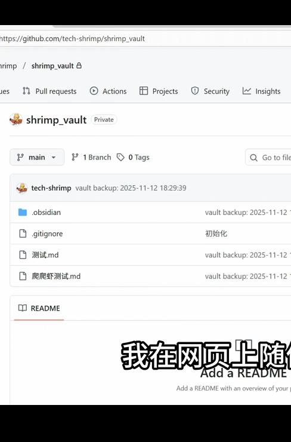

# 贵州茅台（600519.SH）2024年度选股报告

## 一、投资要点摘要

| 核心指标 | 数值 | 表现 |
|---------|------|------|
| 营业总收入 | 1,741.44亿元 | +15.66% |
| 归母净利润 | 862.28亿元 | +15.38% |
| 毛利率 | 91.93% | 略降0.03个百分点 |
| ROE | 31.8% | 行业领先 |
| 资产负债率 | 13.63% | 历史新低 |
| 经营现金流 | 924.64亿元 | +38.85% |
| 分红方案 | 10股派276.24元 | 分红率约75% |

**投资评级：买入**
**核心观点：业绩稳健增长，盈利能力卓越，现金流充沛，分红慷慨，2025年目标营收增速9%，长期投资价值突出。**

---

## 二、核心财务数据解读

### 2.1 营收与利润双增长

2024年，贵州茅台交出了一份亮眼的成绩单：

- **营业总收入**突破1,741.44亿元，同比增长15.66%
- **归母净利润**达到862.28亿元，同比增长15.38%
- **日均盈利**约2.36亿元，盈利能力堪称印钞机

营收和净利润双双实现15%以上的增长，在当前宏观经济环境下展现出强大的抗周期性。

### 2.2 产品结构：双轮驱动格局

| 产品类别 | 营收（亿元） | 同比增长 | 占比 |
|---------|-------------|----------|------|
| 茅台酒 | 1,459.28 | +15.28% | 83.8% |
| 系列酒 | 246.84 | +19.65% | 14.47% |

**核心发现：**
- 茅台酒作为核心支柱保持稳健增长，依然是公司利润的基本盘
- 系列酒增速（+19.65%）显著高于茅台酒，成为第二增长曲线
- "茅台酒稳、系列酒快"的健康发展态势已经形成

### 2.3 盈利能力指标

**毛利率：91.93%**
- 维持在90%以上的超高水平
- 茅台酒毛利率达94.06%，系列酒毛利率79.87%
- 体现了极强的品牌定价权和成本控制能力

**净资产收益率（ROE）：31.8%**
- 处于行业领先水平
- 远超一般消费品公司的回报率
- 股东回报能力卓越

**资产负债率：13.63%**
- 创历史新低
- 财务结构非常健康
- 几乎无有息负债，财务风险极低

---

## 三、现金流与分红

### 3.1 现金流表现强劲

- **经营活动现金流量净额**：924.64亿元，同比增长38.85%
- 现金流增速显著高于净利润增速，盈利质量极高
- 充沛的现金流为企业提供了充足的财务"底盘"

### 3.2 分红政策慷慨

- **分红方案**：每10股派发现金红利276.24元（含税）
- **分红总额**：约347亿元
- **分红率**：约75%（现金分红/净利润）
- 公司承诺2024-2026年分红率不低于75%

以当前股价计算，股息率约3%左右，在A股核心资产中具有吸引力。

---

## 四、竞争优势分析

### 4.1 品牌护城河

- **中国白酒行业绝对龙头**，品牌价值无可撼动
- 茅台酒具有"奢侈品+消费品"双重属性
- 供需结构长期偏紧，具备持续提价能力

### 4.2 渠道优势

- 直销渠道持续拓展
- i茅台数字营销平台成果显著
- 海外市场覆盖64个国家和地区，海外营收51.9亿元

### 4.3 产品矩阵

- 构建"T"型多元化产品矩阵
- 茅台酒主打高端市场，系列酒覆盖中端和次高端
- 产品价格带完整，可满足不同消费层次需求

---

## 五、风险因素

| 风险类型 | 具体描述 | 影响程度 |
|---------|---------|---------|
| 宏观经济风险 | 消费复苏不及预期，高端消费承压 | 中等 |
| 行业竞争风险 | 高端白酒竞争加剧 | 中等 |
| 产能扩张风险 | 基酒产量小幅下降（-1.63%） | 较低 |
| 政策风险 | 白酒消费税等政策变化 | 中等 |
| 估值风险 | 当前估值处于历史中等偏上水平 | 需关注 |

---

## 六、估值分析

### 6.1 历史估值水平

- 当前PE（TTM）约25-30倍区间
- 处于历史估值中枢偏上水平
- 考虑到业绩确定性和分红回报，估值具备合理性

### 6.2 相对估值

相比全球奢侈品巨头：
- LVMH集团PE约20-25倍
- 爱马仕PE约40-50倍
- 贵州茅台作为"中国版奢侈品"，估值具备支撑

### 6.3 2025年展望

- 公司设定2025年营收增速目标为**9%**
- 体现稳健经营策略，不盲目追求高增长
- 双位数增长预期下，当前估值具备吸引力

---

## 七、投资建议

### 7.1 综合评分

| 评估维度 | 评分 | 说明 |
|---------|------|------|
| 盈利能力 | ★★★★★ | 毛利率、ROE均处于行业顶尖水平 |
| 成长性 | ★★★★☆ | 15%左右的稳健增长 |
| 财务健康 | ★★★★★ | 现金流充沛，负债率极低 |
| 分红回报 | ★★★★★ | 75%分红率，股东回报丰厚 |
| 竞争优势 | ★★★★★ | 品牌护城河深厚 |
| 估值安全 | ★★★☆☆ | 估值不低但具备支撑 |

**综合评分：4.7/5.0**

### 7.2 投资策略建议

**适合投资者类型：**
- 长期价值投资者
- 追求稳定分红收益的投资者
- 看好中国高端消费升级的投资者

**操作建议：**
1. **长期投资者**：可逢低分批建仓，作为核心资产长期持有
2. **稳健型投资者**：关注股息率，持有获取稳定分红回报
3. **成长型投资者**：关注系列酒增长和海外市场拓展进度

**关键观察指标：**
- 批价走势（飞天茅台一批价）
- 基酒产量恢复情况
- 系列酒增速持续性
- 直销渠道占比提升

---

## 八、结论

贵州茅台作为中国A股核心资产，具备卓越的盈利能力、强大的品牌护城河和充沛的现金流。2024年业绩稳健增长，15%左右的增速在当前环境下难能可贵。系列酒表现亮眼，成为第二增长曲线。

**核心观点：业绩确定性强、分红慷慨、品牌护城河深厚，适合长期持有。**

---

## 数据来源

- [贵州茅台2024年年度报告（完整版）](https://www.moutaichina.com/mtgf/articleFileDir/2025-04/08/8055b7bed7db41bdbc617f4c9b9ec591.pdf)
- [贵州茅台2024年年度报告摘要](https://www.moutaichina.com/mtgf/articleFileDir/2025-04/08/a8931897311b4d4097b7c0b2bf3207d1.pdf)
- [上交所年度报告](https://static.sse.com.cn/disclosure/listedinfo/announcement/c/new/2025-04-03/600519_20250403_QVTI.pdf)

---

*报告生成日期：2026年2月7日*
*本报告仅供参考，不构成投资建议。投资有风险，入市需谨慎。*
